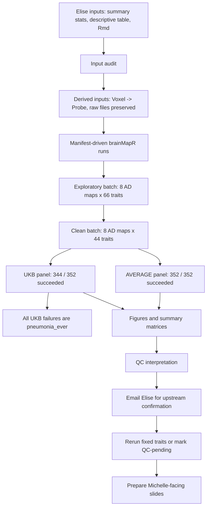

# AD-BWAS Project Progress Report

Last updated: 2026-08-17

## Project Aim

This project tests whether Alzheimer-related brain-wide association maps share
spatial signal with UK Biobank-derived risk-factor BWAS maps.

The core question is:

**Which risk-factor-associated brain patterns are most similar to
Alzheimer-related brain patterns?**

This is a brain-map-level comparison. It is not a SNP-level GWAS and should not
be interpreted causally.

## Current Analysis Scope

The current reviewed analysis uses:

```text
8 Alzheimer-related BWAS maps
x
44 cleaned UKB risk-factor BWAS maps
=
352 pairwise comparisons
```

The 8 Alzheimer-related maps have confirmed fixed sample sizes:

| Alzheimer-related map | Sample size |
| --- | ---: |
| AD vs HC | 3542 |
| MCI vs HC | 3976 |
| Conversion within 1 year | 1257 |
| Conversion within 2 years | 1199 |
| Conversion within 3 years | 1031 |
| Conversion within 4 years | 1285 |
| Conversion within 5 years | 1197 |
| MMSE | 6981 |

The cleaned UKB risk-factor set follows Baptiste's feedback:

- Specific alcohol beverage variables were removed.
- Global alcohol measures were retained.
- `T2D` was retained as the selected diabetes variable.
- More clinical psychiatric diagnoses were retained.
- Broad/pre-imaging psychiatric definitions were removed.
- Currently unusable or pending upstream BWAS traits were excluded from the
  clean rerun.

## Completed Work

### Package and Environment

- Resolved the `GFA::ldsc_rg()` dependency issue by using the GitHub version of
  `GFA` from `jean997/GFA`.
- Confirmed `brainMapR::sumR2_regression_bivariate()` is available.
- Confirmed the installed BrainMapR function includes `varConstrained`.
- Confirmed `varConstrained` is used inside the function body.
- Updated the batch wrapper to pass `varConstrained = TRUE` explicitly.
- Confirmed all clean AVERAGE rerun metadata files record
  `varConstrained = TRUE`.

### Input Preparation

- Audited AD BWAS files and UKB risk-factor BWAS files.
- Preserved all raw inputs.
- Created derived UKB inputs with `Voxel` renamed to `Probe`.
- Fixed UKB files where an extra row-name column shifted the data columns.
- Generated manifest-driven design tables for:
  - Full exploratory pairwise analysis.
  - Clean AVERAGE rerun.
  - Clean UKB reference-panel sensitivity rerun.

### Exploratory Full Batch

The first full exploratory batch used the broader default risk-factor set:

```text
8 AD maps x 66 UKB risk-factor maps = 528 jobs
```

Outcome:

```text
488 successful jobs
40 failed jobs
```

The 40 failures corresponded to 5 UKB traits across all 8 AD maps:

```text
htn_i10_preimg
med_20003_n_distinct_i2
periodontal_k05_preimg
psy_any_strict_preimg
stroke
```

These traits had no usable association statistics, such as `b = 0`, `se = 0`,
and `p = NA`, and were excluded from the clean rerun pending upstream checks.

### Clean Rerun

Clean AVERAGE reference-panel rerun:

```text
352 / 352 successful
```

Clean UKB reference-panel sensitivity rerun:

```text
344 / 352 successful
8 failed
```

The 8 UKB-panel failures all corresponded to:

```text
pneumonia_ever
```

This trait succeeded under the AVERAGE panel but failed under the UKB panel
with:

```text
object 'BWASsignif2' not found
```

This looks reference-panel or input-specific rather than a general workflow
failure.

### Figures and Tables

The cleaned results were collected into:

```text
outputs/batch/summary_clean_AVERAGE/
outputs/batch/summary_clean_UKB/
```

Updated outputs include:

- Vertical rGM heatmap with UKB traits on the Y axis and AD maps on the X axis.
- Vertical p-value heatmap.
- Top stable rGM forest plot.
- AVERAGE-vs-UKB reference-panel sensitivity scatter plot.
- AVERAGE-vs-UKB rGM shift-outlier table for sensitivity interpretation.
- Bonferroni/FWER-based significance markers.
- PNG and TIFF exports.
- Readable trait and AD labels.

Current clean AVERAGE plotting summary:

```text
AD maps: 8
Risk-factor maps: 44
Collected pairs: 352
Bonferroni/FWER-significant pairs: 126
Out-of-range rGM estimates: 13
Top stable associations written: 30
```

Meeting follow-up decision:

- Do not create a separate AVERAGE-vs-UKB p-value sensitivity figure.
- Focus the reference-panel sensitivity display on effect sizes (`rGM`).
- Annotate the effect-size sensitivity scatter with the largest
  AVERAGE-to-UKB shifts, using labels such as `0.86 -> 0.48`.

The plotting script now implements this in:

```text
scripts/06_plot_brainMapR_summary.R
```

The updated script writes:

```text
outputs/batch/summary_clean_AVERAGE/reference_panel_shift_outliers.tsv
```

and updates:

```text
outputs/batch/summary_clean_AVERAGE/figures/figure_4_reference_panel_sensitivity.png
outputs/batch/summary_clean_AVERAGE/figures/figure_4_reference_panel_sensitivity.tiff
```

when rerun on a machine with `Rscript` and `ggplot2`.

## Problems Identified and Current Interpretation

### 2026-08-17 Meeting Follow-Up and Handoff Update

This section records the follow-up checks performed after the supervisor
meeting about out-of-range rGM estimates, missing rows, phenotype coding, and
reference-panel sensitivity.

Meeting interpretation stance:

- Do not over-interpret alcohol, smoking, insomnia, pneumonia, infection
  recency, or any `|rGM| > 1` estimates until input integrity, coding, and
  covariates are confirmed.
- Treat shared spatial signal and map-level similarity as descriptive
  brain-map-level results only. Do not frame these as causal or SNP-level GWAS
  findings.
- Prepare Michelle-facing slides only after flagged traits are either fixed,
  excluded, or clearly labelled as QC-pending.

Additional local outputs inspected:

```text
/Users/junzhou/Desktop/summary_clean_AVERAGE
/Users/junzhou/Desktop/brainMapR_pairs_clean_AVERAGE
/Users/junzhou/Desktop/qc_out_of_range_pairs
/Users/junzhou/Desktop/brainMapR_pairs_clean_UKB
```

The `qc_out_of_range_pairs` directory was confirmed to be an AVERAGE-panel
out-of-range subset, not a UKB-panel rerun. The true UKB raw-output directory
is `brainMapR_pairs_clean_UKB`.

Updated raw-output status:

| Output set | Pair directories | Successful `.rsq` outputs | Failed runs | Notes |
| --- | ---: | ---: | ---: | --- |
| AVERAGE raw pairs | 352 | 352 | 0 | All jobs succeeded |
| UKB raw pairs | 352 | 344 | 8 | All failures are `pneumonia_ever` |

The 8 UKB failures are all:

```text
ADvsHC__pneumonia_ever
Conversion1year__pneumonia_ever
Conversion2years__pneumonia_ever
Conversion3years__pneumonia_ever
Conversion4years__pneumonia_ever
Conversion5years__pneumonia_ever
MCIvsHC__pneumonia_ever
MMSE__pneumonia_ever
```

Each failed with:

```text
object 'BWASsignif2' not found
```

Current technical conclusions:

| Trait | Current status | Evidence | Action |
| --- | --- | --- | --- |
| `pa_vigorous_time` | Not interpretable in current rGM results | AVERAGE rGM approximately 15-30; UKB rGM approximately 1.5-4.0; `rGM_se`, p-value, and CI are `NA`; trait-side variance is near zero (`m2_2 = 1e-05` under AVERAGE and `m2_2 = 0.000464171` under UKB) | Exclude or grey out in main figures; ask Elise about coding, scale, transforms, missing values, and extreme values |
| `pneumonia_ever` | QC-pending input | Local file has only about 19,730 rows instead of approximately 654,003; AVERAGE runs have several rGM estimates slightly above 1; all UKB runs fail | Ask Elise to confirm whether file is incomplete and regenerate/re-upload if needed |
| `infect_recency_days` | Sensitivity unstable | AVERAGE has one out-of-range estimate (`Conversion2years`, rGM about -1.13, not significant); UKB gives about -0.47 with significant p-value for the same pair | Interpret cautiously; ask Elise about coding, scale, and missingness |

Additional row-count checks showed other reduced or empty UKB trait files:

| Trait file | Observed row count | Current interpretation |
| --- | ---: | --- |
| `sstat_FS_All_moda_total_pneumonia_ever.linear` | 19,730 | Severe missing-row/input issue |
| `sstat_FS_All_moda_total_sepsis_ever.linear` | 128,581 | Reduced row count; needs upstream confirmation |
| `sstat_FS_All_moda_total_diabetes_doctor_dx.linear` | 255,667 | Reduced row count; needs upstream confirmation |
| `sstat_FS_All_moda_total_other_alcohol_weekly_intake.linear` | 613,514 | Slightly reduced row count; likely missingness-related but should be confirmed |
| `sstat_FS_All_moda_total_Menopause.linear` | 1 | Header only |
| `sstat_FS_All_moda_total_hrt_ever_used.linear` | 1 | Header only |

AD BWAS files were checked separately and all observed AD files have
approximately `654,003` rows, so the main input-integrity problems currently
appear concentrated on the UKB risk-factor side.

### Alcohol Coding Follow-Up

The alcohol section of `SSTAT_BingJing/16_BingJing.Rmd` was inspected.

`Alcohol_intake_frequency` is not used as raw `1-6` coding. It is recoded into
approximate weekly frequency:

```text
1 -> 7
2 -> 3.5
3 -> 1.5
4 -> 0.5
5 -> 0.25
6 -> 0
-3 -> NA
```

Therefore, based on the Rmd, the generated alcohol-frequency variable has:

```text
higher value = more frequent drinking
```

This reduces the concern that the raw UKB category order was accidentally
treated as a numeric scale in the wrong direction. Remaining alcohol questions
are about interpretation and missingness rather than simple sign inversion.

`Alcohol_week_avg` is generated as `Avg_total`. The Rmd combines weekly and
monthly alcohol intake by beverage type:

- If weekly and monthly values are both available, use
  `(weekly + monthly / 4) / 2`.
- If only weekly is available, use weekly.
- If only monthly is available, use `monthly / 4`.
- Treat `-1` and `-3` as missing.
- Then take the mean across available beverage types.

Current interpretation: `Alcohol_week_avg` appears to be a mean weekly intake
across available beverage types, not a summed total weekly alcohol intake.

`Alcohol_merge_phenotype` is generated as `Final_Alcohol_phenotype`:

- If frequency is missing and `Avg_total` exists, use `Avg_total`.
- If `Avg_total` is missing and frequency exists, use modified frequency.
- If both exist, use the mean of modified frequency and `Avg_total`.

Current interpretation: `Alcohol_merge_phenotype` is a composite alcohol
exposure score, not a directly interpretable drinks-per-week measure. It mixes
approximate weekly drinking frequency with mean weekly beverage intake.

Descriptive-table alcohol values extracted from `DescriptiveTable.docx`:

| Phenotype | Distribution |
| --- | --- |
| Alcohol intake frequency | Mean = 2.76, SD = 1.31, NA = 1,991 |
| White wine weekly intake | Mean = 1.95, SD = 3.48, NA = 2,970 |
| Red wine weekly intake | Mean = 2.73, SD = 4.08, NA = 2,962 |
| Ever drinker | 0: N = 848; 1: N = 36,791; NA = 1,991 |
| Fortified wine weekly intake | Mean = 0.14, SD = 0.72, NA = 2,903 |
| Spirits weekly intake | Mean = 1.24, SD = 2.77, NA = 2,954 |
| Beer/cider weekly intake | Mean = 1.72, SD = 3.29, NA = 2,904 |
| Other alcohol weekly intake | Mean = 0.020, SD = 0.33, NA = 2,873 |

Questions for Elise should therefore focus on:

- Confirming the intended interpretation of `Alcohol_week_avg` as a mean
  across beverage types rather than a total weekly intake.
- Confirming the intended interpretation of `Alcohol_merge_phenotype`.
- Confirming whether former drinkers or former heavy drinkers were set to
  missing for any alcohol variables.
- Confirming whether any additional special values beyond `-1` and `-3` were
  handled.

### Coding and Covariate Questions Still Open

The following meeting questions are still unresolved and need Elise's upstream
confirmation:

| Topic | What is known now | What remains to confirm |
| --- | --- | --- |
| Alcohol | Rmd recodes alcohol frequency so higher values mean more frequent drinking | Whether former/heavy former drinkers are missing; whether `Alcohol_week_avg` and `Alcohol_merge_phenotype` are intended as mean/composite scores |
| Smoking | `smoking_ever` shows negative/protective-looking directions for several AD/conversion maps | Confirm whether `1 = ever smoked` and whether there was any recoding/filtering |
| Insomnia | `insomnia` shows negative/protective-looking directions for several AD/conversion maps | Confirm whether higher values mean more insomnia and whether any UKB category direction needs reversal |
| Sleep duration | Effects are mostly positive for AD/conversion maps; sleep may be nonlinear | Confirm raw hours coding and whether quadratic/categorical sleep should be modeled upstream |
| PA vigorous time | Complete row count but unstable map-level variance | Confirm unit, transform, outlier handling, missing codes, and whether this phenotype should be rerun/excluded |
| Pneumonia | Severe missing-row issue and UKB failure | Confirm whether current summary statistics are incomplete and regenerate/re-upload if needed |
| Sepsis and diabetes doctor diagnosis | Reduced row counts | Confirm whether reduced rows are expected or upstream generation issues |
| Covariates | Not fully resolved from local code inspection | Confirm covariates used in BWAS/RGM models, especially whether BMI was included |

### Draft Follow-Up Email to Elise

The following updated email draft includes the current QC findings and the
alcohol-code inspection from the Rmd:

```text
Subject: Re: Summary statistics

Hi Elise,

Thanks again for sharing the summary statistics, descriptive table, and Rmd code.

I have now gone through the files and run the brainMapR / rGM pipeline using the cleaned trait set. Most files ran successfully, but I found a few input/QC issues that I wanted to check with you before interpreting the results.

Briefly, the clean AVERAGE reference-panel run completed for all pairs, but the UKB reference-panel sensitivity run failed for all pneumonia pairs. The main issues are:

1. Incomplete or unusable summary statistics

From my local copy, most complete BWAS files have around 654,003 rows. However, a few traits have much fewer rows or no usable data:

- `pneumonia_ever`: ~19,730 rows only
- `sepsis_ever`: ~128,581 rows
- `diabetes_doctor_dx`: ~255,667 rows
- `other_alcohol_weekly_intake`: ~613,514 rows
- `Menopause`: header only
- `hrt_ever_used`: header only

In the earlier exploratory run, the following traits also had no usable association statistics, e.g. `b = 0`, `se = 0`, or `p = NA`, and were excluded from the cleaned rerun pending upstream checks:

- `htn_i10_preimg`
- `med_20003_n_distinct_i2`
- `periodontal_k05_preimg`
- `psy_any_strict_preimg`
- `stroke`

Could you confirm whether these reduced/empty files are expected because of phenotype-specific filtering, or whether they may reflect an upstream phenotype/BWAS generation issue?

2. Pneumonia

`pneumonia_ever` is particularly important. It runs under the AVERAGE reference panel, but several rGM estimates are slightly >1. Under the UKB reference panel, all 8 pneumonia pairs fail with:

`object 'BWASsignif2' not found`

Given the very small number of rows, I am treating pneumonia as QC-pending for now. Would it be possible to regenerate or re-upload the full pneumonia summary statistics if the current file is incomplete?

3. PA vigorous time and infection recency

`pa_vigorous_time` has a complete row count, but gives unstable rGM estimates in both AVERAGE and UKB reference panels. The estimated map variance is extremely small, which inflates rGM and gives NA SE/p/CI.

`infect_recency_days` also has very large beta ranges and one unstable out-of-range estimate in the AVERAGE run.

Could you confirm how these variables were coded, scaled, transformed, and whether any extreme values or special missing codes were handled before running the BWAS?

4. Alcohol coding

I also checked the Rmd for the three alcohol variables. It looks like alcohol intake frequency was recoded from the original UKB categories into approximate weekly frequency:

- `1 -> 7`
- `2 -> 3.5`
- `3 -> 1.5`
- `4 -> 0.5`
- `5 -> 0.25`
- `6 -> 0`

So the generated variable seems to have higher values corresponding to more frequent drinking, rather than using the raw 1-6 scale directly. Could you confirm that this is correct?

I also wanted to check the intended interpretation of `Alcohol_week_avg` and `Alcohol_merge_phenotype`. From the Rmd, `Alcohol_week_avg` appears to average weekly/monthly converted values across beverage types, rather than summing total weekly alcohol intake. `Alcohol_merge_phenotype` then averages this value with the modified alcohol-frequency variable when both are available.

Could you confirm whether this was the intended coding, and whether former drinkers or former heavy drinkers were set to missing for any of these alcohol traits?

5. Other coding and covariates

Could you also confirm the coding direction for:

- `smoking_ever`
- `insomnia`
- `sleep_duration`

And could you confirm the covariates used in the BWAS/RGM models, especially whether BMI was included? I want to make sure the interpretation of metabolic and vascular traits is accurate.

Finally, Baptiste mentioned adding `3581 Age at menopause`. Is that phenotype available, or should I wait before including it?

I can send the QC tables if useful. It may also be helpful to have a short meeting next week to go through these flagged traits and decide which ones should be excluded, regenerated, or interpreted cautiously.

Best,
Bing
```

### Header-Only Traits

The following traits contained only headers and no usable data:

```text
Menopause
hrt_ever_used
```

These are pending upstream checks. Baptiste also suggested adding:

```text
3581 Age at menopause
```

### All-Zero or Unusable BWAS Traits

The following traits had unusable BWAS outputs in the exploratory full batch:

```text
htn_i10_preimg
med_20003_n_distinct_i2
periodontal_k05_preimg
psy_any_strict_preimg
stroke
```

Potential explanations include zero cases in the imaging subset, pre-imaging
phenotype derivation issues, or sex-covariate issues for sex-specific traits.
These need Elise's upstream confirmation.

### Remaining Out-of-Range rGM Estimates

Even after explicitly setting `varConstrained = TRUE`, the clean AVERAGE rerun
still has 13 estimates outside the theoretical `[-1, 1]` range.

Checks completed:

- BrainMapR includes `varConstrained`.
- The function body uses `varConstrained`.
- The batch wrapper passes `varConstrained = TRUE`.
- All 352 clean AVERAGE run metadata files record `varConstrained = TRUE`.
- Timestamps confirm the outputs are from the new rerun, not old results.

The 13 out-of-range estimates are concentrated in three traits:

| Trait | Out-of-range count | Current interpretation |
| --- | ---: | --- |
| `pa_vigorous_time` | 8 | Complete map, but very large beta/SE scale; likely unstable |
| `pneumonia_ever` | 4 | Incomplete map and UKB-panel failure; likely upstream/input issue |
| `infect_recency_days` | 1 | Complete map, but very large beta/SE scale; likely unstable |

Input checks:

- `pa_vigorous_time` has a complete map but a large beta range
  approximately `-370` to `368`.
- `infect_recency_days` has a complete map but an even larger beta range
  approximately `-1522` to `2030`.
- `pneumonia_ever` has only about `19.7k` rows rather than the expected
  approximately `654k`, and failed across all 8 AD maps under the UKB
  reference panel.
- The AD-side BWAS files are complete at approximately `654k` rows, so the
  current row-count issues are concentrated on selected UKB risk-factor files.

Current interpretation:

```text
The remaining |rGM| > 1 estimates are unlikely to be caused by missing
varConstrained or stale outputs. They appear concentrated in specific unstable
or incomplete trait inputs.
```

These traits should be flagged or excluded from the main interpretable figure
unless Baptiste recommends a BrainMapR-side fix.

### Meeting Follow-up QC and Coding Checks

The May meeting raised several interpretation and QC concerns. The current
status is:

| Topic | What was checked | Current conclusion |
| --- | --- | --- |
| Reference-panel p-values | Meeting notes and plotting workflow | Do not make a separate p-value sensitivity figure; use effect-size sensitivity instead. |
| AVERAGE-vs-UKB shift points | `reference_panel_rGM_comparison.tsv` | Most points are broadly consistent; largest in-range shifts include `infect_recency_days`, `infect_count_total`, `uti_ever`, `BD`, `bmi`, and `ldl_direct`. |
| `pa_vigorous_time` | Descriptive table, summary stats, local trait rules | Complete row count, but unstable in both panels. It appears to come from UKB field `104900` with raw codes `0, 1, 13, 35, 57, 79, 912, 1200`; confirm whether raw codes were used as numeric values. |
| `infect_recency_days` | Descriptive table, summary stats, local trait rules | Defined as days from imaging to most recent pre-imaging infection. It has many missing values and only about `2,432` usable BWAS samples; confirm modelling among only prior-infection cases and any scaling/winsorisation. |
| Alcohol frequency coding | `16_BingJing.Rmd`, UKB coding, local trait rules | Raw UKB coding direction is likely not the explanation. The Rmd recodes `1 -> 7`, `2 -> 3.5`, `3 -> 1.5`, `4 -> 0.5`, `5 -> 0.25`, `6 -> 0`, `-3 -> NA`. |
| Alcohol interpretation | AVERAGE and UKB rGM results | AVERAGE estimates tend to look protective for AD/conversion, but UKB estimates are weaker or switch direction. Treat alcohol as sensitivity/QC-pending until construction is confirmed. |
| Alcohol former-drinker handling | `16_BingJing.Rmd` and `ukb-AD-traits` rules | Local trait rules exclude former drinkers with field `3731`; the Rmd section for the three new alcohol phenotypes does not clearly show field `3731`. Confirm with Elise. |
| `Alcohol_week_avg` | `16_BingJing.Rmd` | Appears to average across selected beverage types rather than sum total weekly intake. Confirm whether this was intentional. |
| `Alcohol_merge_phenotype` | `16_BingJing.Rmd` | Appears to average a frequency-like variable with an amount-like variable. Confirm intended interpretation. |
| `smoking_ever` | Local trait rules and descriptive table | Despite the name, it appears to be current smoker vs never smoker, with former smokers set to `NA`; confirm intended definition. |
| `insomnia` | Local trait rules, frailty coding, descriptive table | Uses UKB field `1200`; higher values likely indicate more insomnia. Negative AD/conversion rGM direction is unexpected and should be interpreted cautiously. |
| `sleep_duration` | Local trait rules and descriptive table | Uses UKB field `1160`, apparently as raw hours with no transformation or categorisation. Interpret cautiously because sleep duration may be U-shaped. |
| Covariates | Rmd and meeting notes | Exact BWAS/RGM covariates remain unresolved, especially whether BMI was included. Confirm with Elise. |

Local output directories inspected during follow-up:

```text
/Users/junzhou/Desktop/summary_clean_AVERAGE
/Users/junzhou/Desktop/brainMapR_pairs_clean_AVERAGE
/Users/junzhou/Desktop/brainMapR_pairs_clean_UKB
/Users/junzhou/Desktop/qc_out_of_range_pairs
```

`qc_out_of_range_pairs` was confirmed to contain an AVERAGE-panel QC subset,
not UKB outputs.

## Handoff Snapshot

This is the current handoff state for resuming the project later.

### Current Stage

The project is past the initial feasibility stage. The current state is:

```text
input audit -> manifest pipeline -> clean AVERAGE/UKB reruns ->
result collection/figures -> QC interpretation -> Elise confirmation pending
```

The analysis is executable and has produced interpretable clean outputs for
most traits. The main remaining blocker is not the pipeline itself, but
upstream trait definition / file integrity confirmation for flagged traits.

### Workflow Status



### Main Findings to Carry Forward

- The AD-side BWAS files are complete at approximately `654k` rows.
- Most risk-factor BWAS files are complete and usable after `Voxel -> Probe`
  derived-input handling.
- `pneumonia_ever` is the clearest upstream file-integrity issue:
  approximately `19.7k` rows, AVERAGE-panel rGM slightly above 1 for several
  outcomes, and all 8 UKB-panel pneumonia pairs failed with
  `object 'BWASsignif2' not found`.
- `pa_vigorous_time` is complete by row count but statistically unstable in
  both reference panels. Local trait rules indicate raw field `104900` codes
  `0, 1, 13, 35, 57, 79, 912, 1200`; confirm whether these were used directly
  as numeric values.
- `infect_recency_days` is complete by row count but has only about `2,432`
  usable BWAS samples and a very large beta range. It should be treated as
  sensitivity/QC-pending until modelling and scaling are confirmed.
- Alcohol frequency raw direction is probably not the problem: the Rmd recodes
  UKB categories to approximate weekly frequency (`1 -> 7`, ..., `6 -> 0`).
  The unresolved issues are former-drinker handling, panel-sensitive alcohol
  rGM directions, `Alcohol_week_avg` as mean across beverage types, and
  `Alcohol_merge_phenotype` averaging frequency-like and amount-like scales.
- `smoking_ever` appears, from local trait rules, to be current smoker vs never
  smoker with former smokers set to `NA`, not a standard ever-smoked indicator.
- `insomnia` appears to use UKB field `1200` directly; higher values likely
  indicate more insomnia. Negative AD/conversion rGM estimates should be
  interpreted cautiously.
- `sleep_duration` appears to use UKB field `1160` as raw hours without
  transformation or categorisation; interpretation should account for possible
  U-shaped effects.
- BWAS/RGM covariates remain unresolved, especially whether BMI was included.

### Elise Confirmation Items

The next email to Elise should ask about:

- Whether reduced/header-only files are expected or upstream BWAS generation
  issues: `pneumonia_ever`, `sepsis_ever`, `diabetes_doctor_dx`,
  `other_alcohol_weekly_intake`, `Menopause`, and `hrt_ever_used`.
- Whether the earlier no-usable-statistics traits should be regenerated or
  excluded: `htn_i10_preimg`, `med_20003_n_distinct_i2`,
  `periodontal_k05_preimg`, `psy_any_strict_preimg`, and `stroke`.
- Whether `pneumonia_ever` can be regenerated/re-uploaded as a complete file.
- Whether `pa_vigorous_time` used raw field `104900` codes or converted
  duration categories before BWAS.
- Whether `infect_recency_days` was intentionally modelled only among
  participants with prior infection dates, and whether scaling,
  winsorisation, or transformation was applied.
- Alcohol trait construction: former/heavy former drinker handling, whether
  `Alcohol_week_avg` was intended as mean rather than total weekly intake, and
  whether `Alcohol_merge_phenotype` intentionally averages frequency and
  amount scales.
- Smoking and sleep trait interpretation: `smoking_ever` as current-vs-never,
  `insomnia` coding direction, and `sleep_duration` as raw linear hours.
- Exact BWAS/RGM covariates, especially whether BMI was included.
- Whether UKB field `3581` age at menopause is available or should wait.

### Result Locations and Raw-Output Handoff

The canonical HPC project root is:

```text
/working/lab_puyag/bingjinZ/Side_Project_AD/SP-BWAS
```

All relative paths below are relative to this HPC project root.

Clean AVERAGE main results:

```text
outputs/batch/summary_clean_AVERAGE/
```

Key AVERAGE summary files:

```text
outputs/batch/summary_clean_AVERAGE/brainmapr_pairwise_results_long.tsv
outputs/batch/summary_clean_AVERAGE/matrix_rGM.tsv
outputs/batch/summary_clean_AVERAGE/matrix_pvalue_rGM.tsv
outputs/batch/summary_clean_AVERAGE/matrix_rGM_CI_lb.tsv
outputs/batch/summary_clean_AVERAGE/matrix_rGM_CI_ub.tsv
outputs/batch/summary_clean_AVERAGE/top_associations_bonferroni.tsv
outputs/batch/summary_clean_AVERAGE/out_of_range_rGM.tsv
outputs/batch/summary_clean_AVERAGE/reference_panel_rGM_comparison.tsv
outputs/batch/summary_clean_AVERAGE/reference_panel_shift_outliers.tsv
outputs/batch/summary_clean_AVERAGE/figure_generation_report.txt
```

Main figure files:

```text
outputs/batch/summary_clean_AVERAGE/figures/figure_1_vertical_rGM_heatmap.png
outputs/batch/summary_clean_AVERAGE/figures/figure_1_vertical_rGM_heatmap.tiff
outputs/batch/summary_clean_AVERAGE/figures/figure_2_vertical_pvalue_heatmap.png
outputs/batch/summary_clean_AVERAGE/figures/figure_2_vertical_pvalue_heatmap.tiff
outputs/batch/summary_clean_AVERAGE/figures/figure_3_top_rGM_forest.png
outputs/batch/summary_clean_AVERAGE/figures/figure_3_top_rGM_forest.tiff
outputs/batch/summary_clean_AVERAGE/figures/figure_4_reference_panel_sensitivity.png
outputs/batch/summary_clean_AVERAGE/figures/figure_4_reference_panel_sensitivity.tiff
```

Clean UKB reference-panel sensitivity summaries:

```text
outputs/batch/summary_clean_UKB/
outputs/batch/summary_clean_UKB/brainmapr_pairwise_results_long.tsv
outputs/batch/summary_clean_UKB/matrix_rGM.tsv
outputs/batch/summary_clean_UKB/matrix_pvalue_rGM.tsv
outputs/batch/summary_clean_UKB/matrix_rGM_CI_lb.tsv
outputs/batch/summary_clean_UKB/matrix_rGM_CI_ub.tsv
```

Raw per-pair brainMapR output directories:

```text
outputs/batch/brainMapR_pairs_clean_AVERAGE/
outputs/batch/brainMapR_pairs_clean_UKB/
```

Each pair directory usually contains:

```text
*.rsq
sumR2_regression_bivariate_result.rds
run_metadata.tsv
run_status.tsv
```

PBS `.out` / `.err` files are not stored inside each pair directory. Array
logs are under:

```text
logs/brainMapR_array.*.R.log
logs/brainMapR_array.pbs.log
```

Out-of-range AVERAGE-panel QC pair directories to inspect or share:

```text
outputs/batch/brainMapR_pairs_clean_AVERAGE/ADvsHC__pa_vigorous_time/
outputs/batch/brainMapR_pairs_clean_AVERAGE/Conversion1year__pa_vigorous_time/
outputs/batch/brainMapR_pairs_clean_AVERAGE/Conversion2years__pa_vigorous_time/
outputs/batch/brainMapR_pairs_clean_AVERAGE/Conversion3years__pa_vigorous_time/
outputs/batch/brainMapR_pairs_clean_AVERAGE/MMSE__pa_vigorous_time/
outputs/batch/brainMapR_pairs_clean_AVERAGE/Conversion1year__pneumonia_ever/
outputs/batch/brainMapR_pairs_clean_AVERAGE/Conversion2years__pneumonia_ever/
outputs/batch/brainMapR_pairs_clean_AVERAGE/Conversion3years__pneumonia_ever/
outputs/batch/brainMapR_pairs_clean_AVERAGE/MCIvsHC__pneumonia_ever/
outputs/batch/brainMapR_pairs_clean_AVERAGE/Conversion2years__infect_recency_days/
```

The UKB-panel failure table should be:

```text
outputs/batch/ukb_clean_failed_pairs.tsv
```

The row-count table requested for out-of-range QC should be:

```text
outputs/batch/summary_clean_AVERAGE/sumstats_row_counts.tsv
```

If `sumstats_row_counts.tsv` has not been generated yet, create it on the HPC:

```bash
cd /working/lab_puyag/bingjinZ/Side_Project_AD/SP-BWAS

printf "trait_id\tfile\trows\tusable\tb_zero\tse_zero\tp_lt_0_05\tp_lt_5e_8\tb_min\tb_max\tse_min\tse_max\tp_min\tp_max\n" \
  > outputs/batch/summary_clean_AVERAGE/sumstats_row_counts.tsv

for trait in pa_vigorous_time pneumonia_ever infect_recency_days
do
  f="outputs/batch/derived_inputs/sstat_FS_All_moda_total_${trait}.Probe.linear"

  awk -v trait="$trait" -v file="$f" '
    NR > 1 {
      n++;
      if ($6 != "NA" && $7 != "NA" && $8 != "NA") {
        usable++;
        b=$6+0; se=$7+0; p=$8+0;
        if (b == 0) b0++;
        if (se == 0) se0++;
        if (p < 0.05) p05++;
        if (p < 5e-8) p5e8++;
        if (usable == 1 || b < bmin) bmin=b;
        if (usable == 1 || b > bmax) bmax=b;
        if (usable == 1 || se < semin) semin=se;
        if (usable == 1 || se > semax) semax=se;
        if (usable == 1 || p < pmin) pmin=p;
        if (usable == 1 || p > pmax) pmax=p;
      }
    }
    END {
      print trait, file, n, usable, b0+0, se0+0, p05+0, p5e8+0, bmin, bmax, semin, semax, pmin, pmax
    }
  ' OFS='\t' "$f" >> outputs/batch/summary_clean_AVERAGE/sumstats_row_counts.tsv
done
```

To bundle the out-of-range QC raw outputs for sharing:

```bash
cd /working/lab_puyag/bingjinZ/Side_Project_AD/SP-BWAS

mkdir -p outputs/batch/qc_out_of_range_pairs

for pair in \
  ADvsHC__pa_vigorous_time \
  Conversion1year__pa_vigorous_time \
  Conversion2years__pa_vigorous_time \
  Conversion3years__pa_vigorous_time \
  MMSE__pa_vigorous_time \
  Conversion1year__pneumonia_ever \
  Conversion2years__pneumonia_ever \
  Conversion3years__pneumonia_ever \
  MCIvsHC__pneumonia_ever \
  Conversion2years__infect_recency_days
do
  mkdir -p "outputs/batch/qc_out_of_range_pairs/$pair"
  cp outputs/batch/brainMapR_pairs_clean_AVERAGE/$pair/* \
     "outputs/batch/qc_out_of_range_pairs/$pair/"
done

cp outputs/batch/summary_clean_AVERAGE/sumstats_row_counts.tsv \
   outputs/batch/qc_out_of_range_pairs/

tar -czf outputs/batch/qc_out_of_range_pairs.tar.gz \
  -C outputs/batch qc_out_of_range_pairs
```

Expected local downloaded equivalents, if copied to the Mac Desktop:

```text
/Users/junzhou/Desktop/summary_clean_AVERAGE/
/Users/junzhou/Desktop/summary_clean_UKB/
/Users/junzhou/Desktop/brainMapR_pairs_clean_AVERAGE/
/Users/junzhou/Desktop/brainMapR_pairs_clean_UKB/
/Users/junzhou/Desktop/qc_out_of_range_pairs/
```

## Files to Share with Collaborators

Recommended figure attachments:

```text
outputs/batch/summary_clean_AVERAGE/figures/figure_1_vertical_rGM_heatmap.png
outputs/batch/summary_clean_AVERAGE/figures/figure_2_vertical_pvalue_heatmap.png
outputs/batch/summary_clean_AVERAGE/figures/figure_3_top_rGM_forest.png
outputs/batch/summary_clean_AVERAGE/figures/figure_4_reference_panel_sensitivity.png
```

Recommended table attachments:

```text
outputs/batch/summary_clean_AVERAGE/top_associations_bonferroni.tsv
outputs/batch/summary_clean_AVERAGE/out_of_range_rGM.tsv
outputs/batch/summary_clean_AVERAGE/reference_panel_rGM_comparison.tsv
outputs/batch/summary_clean_AVERAGE/reference_panel_shift_outliers.tsv
outputs/batch/ukb_clean_failed_pairs.tsv
```

Updated reference-panel sensitivity figure command:

```bash
Rscript scripts/06_plot_brainMapR_summary.R \
  --summary-dir outputs/batch/summary_clean_AVERAGE \
  --design manifests/brainmapr_clean_average_design.tsv \
  --compare-summary-dir outputs/batch/summary_clean_UKB
```

Use an alternate output directory if the previous figures should be preserved:

```bash
Rscript scripts/06_plot_brainMapR_summary.R \
  --summary-dir outputs/batch/summary_clean_AVERAGE \
  --design manifests/brainmapr_clean_average_design.tsv \
  --compare-summary-dir outputs/batch/summary_clean_UKB \
  --out-dir outputs/batch/summary_clean_AVERAGE/figures_updated
```

## Next Steps

1. Rerun `scripts/06_plot_brainMapR_summary.R` on the HPC or another machine
   with `Rscript` to regenerate the updated sensitivity figure and
   `reference_panel_shift_outliers.tsv`.
2. Send Elise the targeted QC email asking about:
   - `Menopause`
   - `hrt_ever_used`
   - `3581 Age at menopause`
   - `htn_i10_preimg`
   - `med_20003_n_distinct_i2`
   - `periodontal_k05_preimg`
   - `psy_any_strict_preimg`
   - `stroke`
   - `pneumonia_ever`
   - `sepsis_ever`
   - `diabetes_doctor_dx`
   - `other_alcohol_weekly_intake`
   - `pa_vigorous_time`
   - `infect_recency_days`
   - alcohol trait construction and former-drinker handling
   - `smoking_ever`, `insomnia`, and `sleep_duration` coding
   - BWAS/RGM covariates, especially whether BMI was included
3. Ask Baptiste whether `pa_vigorous_time`, `infect_recency_days`, and
   `pneumonia_ever` should be excluded from the main interpretable figure,
   greyed out, or handled with another BrainMapR-side fix.
4. After Elise responds, regenerate or rerun fixed upstream traits as needed
   and append them through the manifest-driven pipeline.
5. Prepare Michelle-facing slides using clean AVERAGE results, UKB sensitivity
   results, explicit QC flags, and cautious map-level interpretation.
6. Keep the manifest-driven pipeline ready so fixed or new upstream traits can
   be rerun and appended without reorganizing the project.
